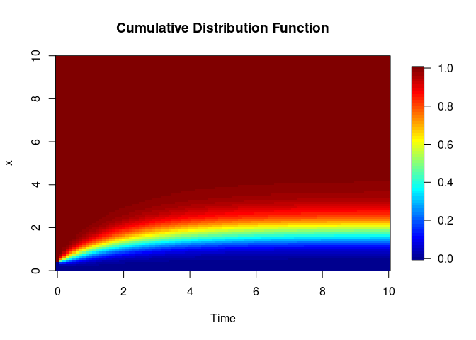
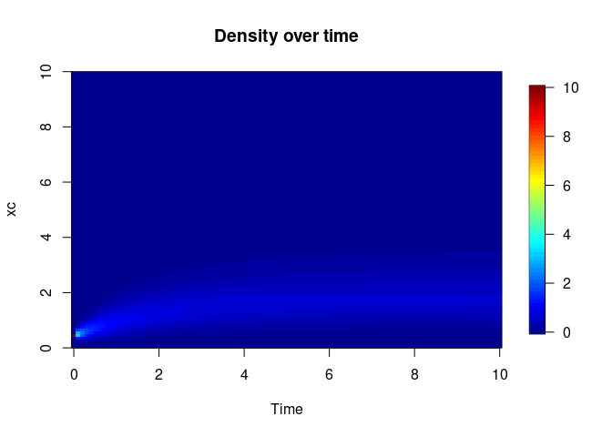
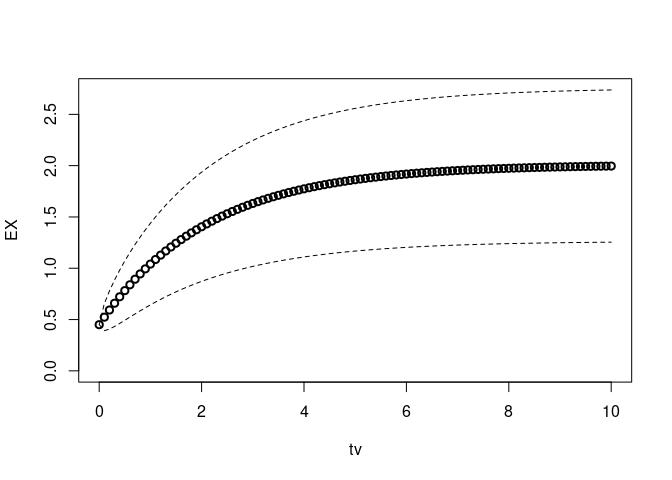
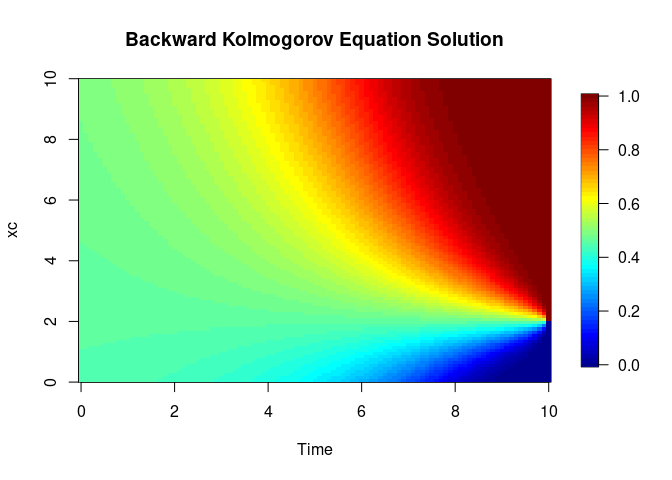

Introduction
============

This R notebook shows an example of using the R library *kolmogorov-equations.R*. The library is designed to solve stochastic differential equations and related Kolmogorov equations,
$$dX_t = f(X_t,t)dt + g(X_t,t)dB_t$$

We suppose existence and uniqueness of a solution of this SDE. 

Backward Equation
-----------------
with the terminal condition $\psi(t,x)=h(x)$ and the backward Kolmogorov operator, 
$$[L\psi]=\nabla \psi \cdot f + \frac{1}{2} Tr\Big( g^\top \mathcal{H}_\psi g\Big).$$
The Backward Kolmogorov equation is then written as, 
$$\dot \psi(s,x) + [L \psi] (s,x) = 0, \quad s < t$$

Forward Equation
----------------
In this respect, the Forward Kolmogorov equation is, 
$$\dot \phi(t,y) - [L^* \phi] (t,y) = 0$$

With, the Forward operator, 
$$[L^* \phi] = - \nabla \cdot \Big(f \phi - \nabla(\frac{1}{2} g g^{\top} \phi )\Big)$$

Stationary Forward Equation
---------------------------
We rewrite the forward equation in a advection-diffusion form, writing $u = f - \nabla D$ and $D = \frac{1}{2} g g^{\top}$, 
$$\dot \phi = - \nabla \cdot (u\phi - D \nabla \phi)$$

Thus, the stationary (w.r.t the time) forward equation ruling $\rho$ is, 
$$[L^* \rho] =  - \nabla \cdot (u\rho - D \nabla \rho) = 0$$

The Library
============

Setting Up
----------

``` r
# Sourcing required scripts
source('kolmogorov-equations.R')
```

Parameters
----------

``` r
# Parameters
xi <- 2
gamma <- 1/2
lambda <- 1/2

# Drift and intensity functions
f <- function(x) lambda * (xi - x)
g <- function(x) gamma * sqrt(abs(x))

# Diffusivity and its spatial derivative
D <- function(x) 0.5 * gamma^2 * x
Dp <- function(x) 0.5 * gamma^2

# Advective flow field
u <- function(x) f(x) - Dp(x)
```

Forward Kolmogorov Equation
===========================

``` r
result <- forwardkolmogorov(u, D)
G <- result$G
phi <- result$phi

plot(xc, phi, main="Forward Kolmogorov Equation Solution", xlab="xc", ylab="phi")
curve(dgamma(x, rate=2*lambda/gamma^2, shape=2*lambda*xi/gamma^2), 
      from=0, to=xmax, add=TRUE, col="red")
legend("topright", legend=c("Numerical Solution", "Theoretical Solution"),
       col=c("black", "red"), lty=c(1, 2), lwd=c(1, 2))
```


``` r
x0 <- xi/4

## Initial condition for the FKE is a dirac
phi0 <- numeric(length(xc))
phi0[sum(xc<x0)] <- 1 

## Time grid
tv <- seq(0,10,0.1)

## Solve the Forward Kolmogorov Equation
PHI <- solve_forwardEquation(tv,phi0,G)

CDF <- apply(PHI*dx, 2, cumsum)
image.plot(tv, xc, t(CDF), main="Cumulative Distribution Function", xlab="Time", ylab="x")
```



``` r
plot(xc, PHI[, length(tv)], col="black", 
     main="Comparison of Numerical and Theoretical Solutions",
     xlab="xc", ylab="PHI")

# Ajout de la courbe théorique
lines(xc, phi, col="red")

# Ajout d'une légende
legend("topright", legend=c("Numerical Solution", "Theoretical Solution"),
       col=c("black", "red"), lwd=c(2, 2))
```


Solving Forward Kolmogorov Equation
-----------------------------------

``` r
# Initial conditions
x0 <- xi/4
phi0 <- numeric(length(xc))
phi0[sum(xc < x0)] <- 1

# Time grid
tv <- seq(0, 10, 0.1)

# Solving the Forward Kolmogorov Equation
PHI <- solve_forwardEquation(tv, phi0, G)

# Plotting the solution
image.plot(tv, xc, t(PHI), main="Density over time", xlab="Time", ylab="xc")
```



Mean, Variance, and Standard Deviation
--------------------------------------

``` r
# Computing moments
EX <- computeMoment(PHI, 1)
VX <- computeVariance(PHI)
sX <- computeStandardDeviation(PHI)

# Plotting the results
plot(tv, EX, lwd=2, ylim=c(0, max(EX + sX)))
lines(tv, EX + sX, lty="dashed")
lines(tv, EX - sX, lty="dashed")
```



Backward Kolmogorov Equation
============================

``` r
h <- (xc >= 2)
T <- tail(tv, 1)
psi <- solve_backwardEquation(tv, h, G)

# Plotting the solution with title and labels
image.plot(tv, xc, t(psi), main="Backward Kolmogorov Equation Solution", xlab="Time", ylab="xc")
```



Conclusion
==========

This notebook provides an overview of the Forward-Backward Kolmogorov
Equations library, its key functions, and visualizations of the
solutions. It serves as a guide for users to understand and utilize the
capabilities of the library in solving stochastic differential
equations.

// Rscript -e “rmarkdown::render(‘example.Rmd’, output\_format = ‘md\_document’)”
